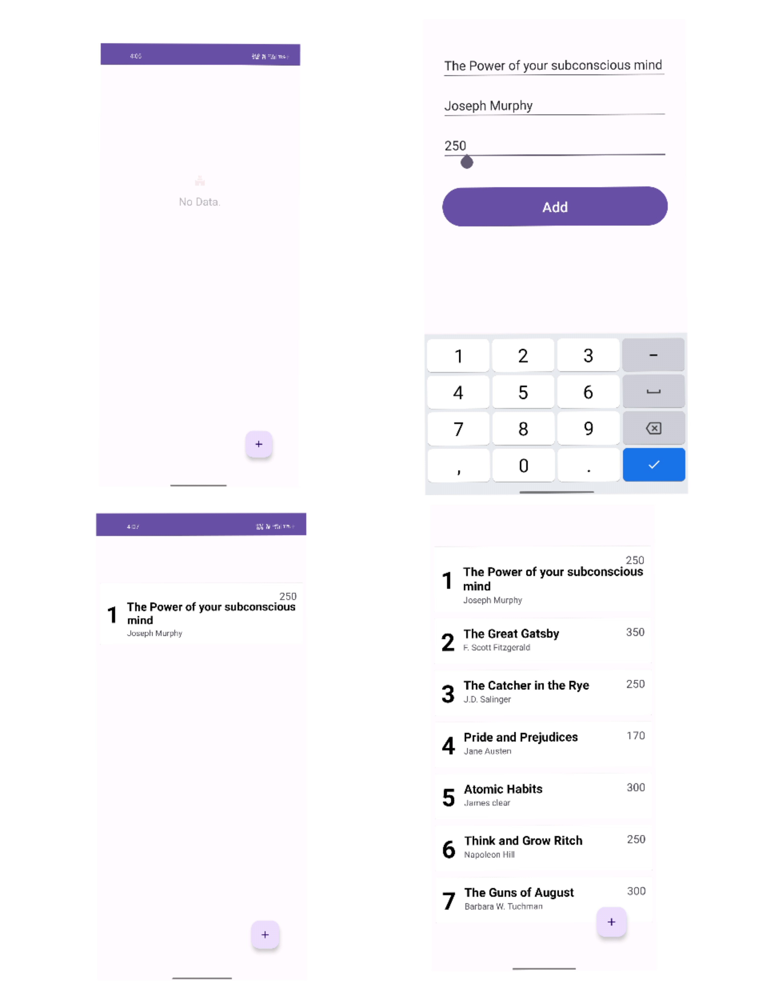
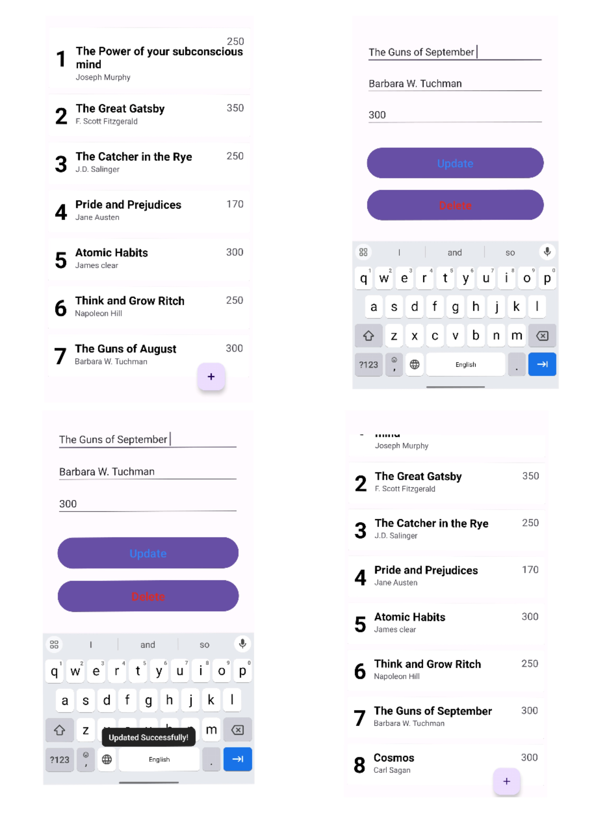
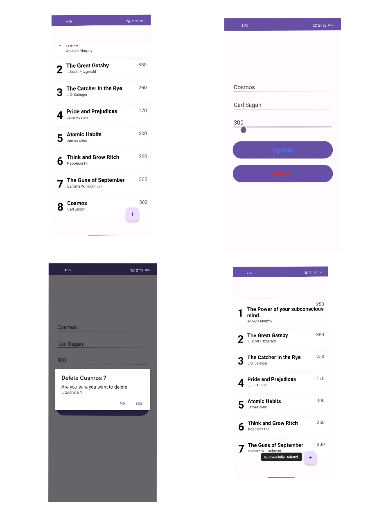

# Book Library App

The Book Library app is a mobile application developed using Android Studio and Java. It provides a user-friendly interface for managing and organizing your book collection. The app utilizes SQLite for efficient data storage, ensuring a seamless experience for users.

## Features

- Add, edit, and remove books from your library.
- Store essential book details, including title, author, and page count.
- Intuitive user interface for easy navigation and interaction.

## Screenshots.

### Home Page and Additions of Books.

### Updations to Books.

### Deletion of Books.

